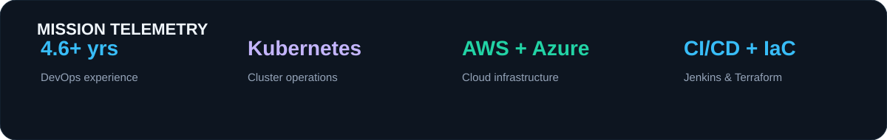
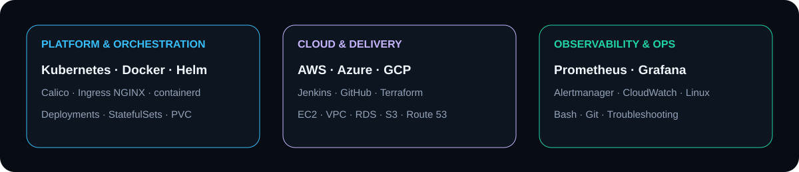

  

 

 

  

 

## 🧰 &nbsp;Stack

  

 

  

 

## 🎯 &nbsp;Focus

DevOps & SRE Engineer focused on designing, automating, monitoring, and troubleshooting cloud-native production infrastructure using Kubernetes, AWS, Jenkins, Terraform, Docker, Linux, Prometheus, and Grafana.

 

Currently building and operating self-managed Kubernetes environments, CI/CD pipelines, cloud infrastructure, ingress/networking, monitoring stacks, and production-style application deployments across AWS and Azure.

 

## 📁 &nbsp;Case studies

Selected hands-on projects showing infrastructure design, deployment, troubleshooting, automation, observability, and cloud operations.

 

<table>
<tr>
<td width="50%" valign="top">

#### 🏦 &nbsp;Java Fintech Kubernetes
Production-style banking application on Kubernetes

Deployed a Java/Spring Boot banking platform with frontend, backend, and PostgreSQL on a self-managed Kubernetes cluster.

<b>Architecture</b> — control plane + worker nodes, Calico networking, persistent storage, Services and Ingress 
<b>Delivery</b> — containerized frontend/backend workloads with Docker and Kubernetes manifests 
<b>Troubleshooting</b> — resolved Pod scheduling, ConfigMap/Secret, NodePort, Ingress, DNS, API URL, and rollout issues 
<b>Operations</b> — readiness checks, health endpoints, node placement, service discovery, and production debugging

`Kubernetes` `Docker` `Spring Boot` `PostgreSQL` `Nginx`

</td>
<td width="50%" valign="top">

#### 📊 &nbsp;Kubernetes Observability
Prometheus, Grafana & Alertmanager monitoring stack

Built a dedicated Kubernetes monitoring stack using Helm and kube-prometheus-stack.

<b>Metrics</b> — Prometheus with persistent storage and retention configuration 
<b>Dashboards</b> — Grafana with persistent storage and NodePort access 
<b>Alerting</b> — Alertmanager configuration and custom PrometheusRule troubleshooting 
<b>Scheduling</b> — nodeSelector, PV node affinity, resources, and multi-node scheduling analysis

`Prometheus` `Grafana` `Alertmanager` `Helm` `Kubernetes`

</td>
</tr>

<tr>
<td width="50%" valign="top">

#### 🛒 &nbsp;E-Commerce Platform
Containerized application with Kubernetes deployment

Designed deployment architecture for frontend, backend, and MySQL/RDS-based e-commerce workloads.

<b>Configuration</b> — ConfigMaps and Secrets for database and application settings 
<b>Reliability</b> — readiness/liveness probes and init-container dependency checks 
<b>Storage</b> — PVC-backed application data where required 
<b>Placement</b> — nodeSelector-based workload scheduling on dedicated worker nodes

`Kubernetes` `Docker` `MySQL` `AWS RDS` `Node.js`

</td>
<td width="50%" valign="top">

#### ☁️ &nbsp;AWS DevOps Infrastructure
Cloud infrastructure, automation & CI/CD

Hands-on AWS infrastructure covering networking, compute, delivery, monitoring, and Infrastructure as Code.

<b>Cloud</b> — EC2, VPC, IAM, S3, RDS, Route 53, CloudFront, Load Balancer and Auto Scaling 
<b>IaC</b> — Terraform modules, variables, state, remote backends and drift detection 
<b>CI/CD</b> — Jenkins pipelines and automated application deployments 
<b>Monitoring</b> — CloudWatch, Prometheus, Grafana and operational troubleshooting

`AWS` `Terraform` `Jenkins` `Linux` `CloudWatch`

</td>
</tr>
</table>

📂 &nbsp;More engineering work

 

🌐 &nbsp;<b>Ingress & Networking</b> — configured ingress-nginx, host-based routing, NodePort exposure, DNS testing, SSL troubleshooting, Calico networking, Security Groups and NACL concepts.

🔧 &nbsp;<b>Kubernetes Administration</b> — kubeadm cluster setup, containerd runtime, swap configuration, worker joins, scheduling, namespaces, Secrets, ConfigMaps, PVCs, Deployments, StatefulSets and Services.

🚀 &nbsp;<b>CI/CD Engineering</b> — Jenkins controller/agent setup, freestyle and pipeline jobs, Docker build/push workflows, Git operations and cloud deployment automation.

☁️ &nbsp;<b>Multi-Cloud Learning</b> — practical AWS experience with ongoing Azure administration and GCP infrastructure work.

 

## 📈 &nbsp;GitHub activity

 

 

 

💬 &nbsp;Open to DevOps, SRE, cloud infrastructure, Kubernetes, CI/CD, and platform engineering opportunities.
 
<a href="https://www.linkedin.com/in/YOUR-LINKEDIN-HANDLE">LinkedIn</a> · <a href="mailto:YOUR-EMAIL">Email</a>

